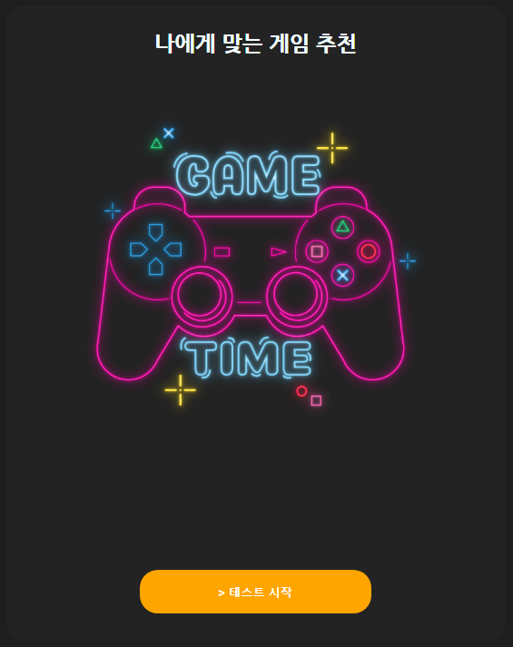
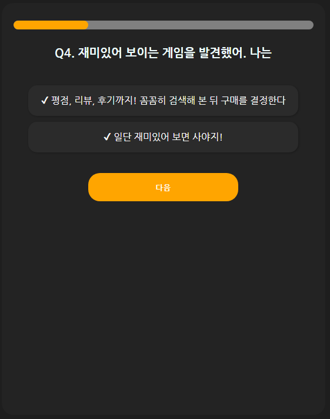
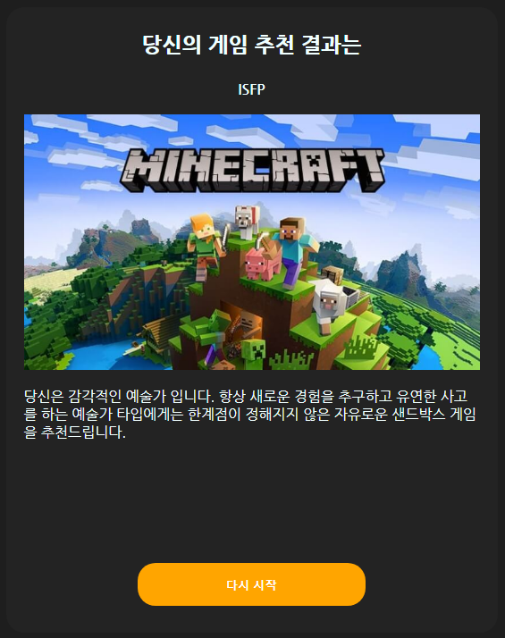

# html, css, js로 MBTI 심리테스트 페이지 만들기
> 취업9조대 스프린트 프로젝트

  
  
  

취업9조대 스터디 내 스프린트 프로젝트. html, css, js를 이용하여 간단한 심리테스트 페이지 만들기

## 사용 예제

## 업데이트 내역

* 0.1.1
  * 추가 : 설문 페이지 progress-bar 추가
  * 수정 : 설문 페이지에서 '다음'버튼이 너무 멀리 있는 디자인 수정
  * 수정 : data.js로 설문 및 답안 내용 분리해 별도 관리
  * 수정 : README 수정
* 0.1.0
  * 첫 출시
  * 수정: 요소간 간격 조절 및 README 추가
* 0.0.1
  * 작업 진행 중

## 정보
배포 [https://humnyenye.github.io/jsmbti/]